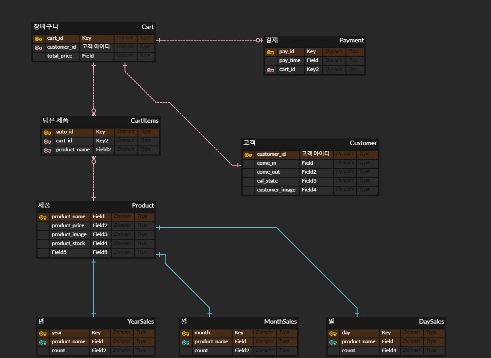
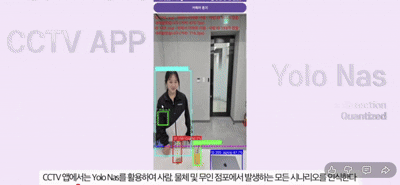
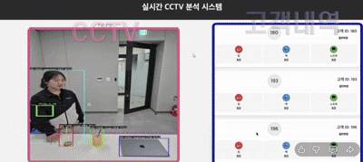
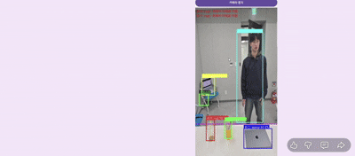
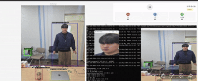
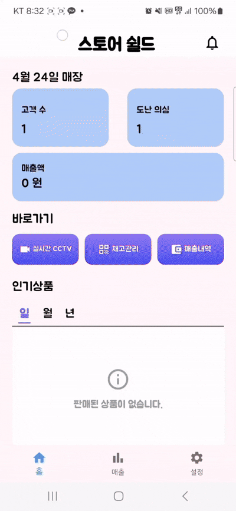

# Store Shield Backend Server

## 📋 개요

**Store Shield Backend Server**는 무인 편의점 시스템의 핵심 백엔드 서버로, CCTV 앱, Flutter 관리자 앱, 웹 키오스크, 실시간 모니터링 페이지 간의 **실시간 양방향 통신**을 담당합니다.

Flask와 Socket.IO 기반으로 구축되어 **실시간 이벤트 처리**, **고객 추적**, **장바구니 관리**, **결제 처리**, **절도 감지** 등의 핵심 기능을 수행하며, MySQL 데이터베이스를 통해 모든 트랜잭션을 관리합니다.

---

## 🎯 왜 Flask를 선택했는가?

### Python 기반 선택 이유

1. **AI 모델 연동**
   - CCTV 앱에서 사용하는 YOLO-NAS, Face Detection 등 AI 모델과의 통합
   - 향후 서버 측 추가 AI 처리 가능성 (이미지 분석, 행동 패턴 분석 등)

2. **데이터 처리**
   - OpenCV를 활용한 이미지/영상 처리
   - NumPy, Pandas를 활용한 데이터 분석
   - Python 생태계의 풍부한 라이브러리 활용

3. **빠른 프로토타이핑**
   - MVP 개발에 적합한 간결한 코드 구조
   - SQLAlchemy ORM으로 데이터베이스 관리 용이

### Flask vs Spring Boot

| 항목 | Flask (채택) | Spring Boot |
|------|--------------|-------------|
| 언어 | Python | Java |
| AI 연동 | ✅ 우수 | ⚠️ 복잡 |
| 이미지 처리 | ✅ OpenCV 네이티브 | ⚠️ 추가 라이브러리 필요 |
| 개발 속도 | ✅ 빠름 | ⚠️ 상대적으로 느림 |
| 학습 곡선 | ✅ 낮음 | ⚠️ 높음 |

---
## 🎯 왜 Socket.IO를 선택했는가?

### 일반 HTTP REST API와의 비교

#### REST API의 근본적인 제한

REST API는 **요청-응답(Request-Response) 구조**로, 클라이언트만 요청을 시작할 수 있습니다. 서버는 클라이언트의 요청이 있을 때만 응답할 수 있으며, **서버가 먼저 클라이언트에게 데이터를 보낼 수 없습니다**.

#### 폴링(Polling)의 문제점

실시간 업데이트를 위해 REST API는 **폴링(Polling)** 방식을 사용해야 합니다. 클라이언트가 일정 주기로 서버에 반복 요청하는 방식입니다:

```javascript
// 클라이언트가 1초마다 서버에 요청
setInterval(() => {
    fetch('http://server.com/api/customers')
        .then(response => response.json())
        .then(data => {
            updateCustomerList(data);
        });
}, 1000);  // 1초마다 반복!
```

**폴링의 3가지 문제:**

1. **낭비 (Waste)**
   - 변화가 없어도 계속 요청
   - 대부분의 요청이 "변화 없음" 응답
   - 네트워크 대역폭 낭비

2. **지연 (Delay)**
   - 1초마다 요청하면 최대 1초 지연 발생
   - 고객이 0.1초에 등장해도 1초 후에야 알 수 있음
   - 실시간성 부족

3. **서버 부하 (Load)**
   - 100개 클라이언트 × 1초마다 요청 = 초당 100개 요청
   - 대부분 불필요한 요청
   - 서버 리소스 낭비

#### Socket.IO의 해결 방법

Socket.IO는 **지속적인 연결(Persistent Connection)**을 유지하여 서버가 능동적으로 데이터를 푸시할 수 있습니다

**Socket.IO 코드 예시:**

```javascript
// 서버 (Flask + Socket.IO)
@socketio.on('message')
def handle_message(message):
    if data.get('type') == 'personAppearance':
        # 고객 등장 이벤트 처리
        
        # 모든 클라이언트에게 즉시 알림!
        emit('customer_update', {
            'customers': get_todays_customers()
        }, broadcast=True)  # ← 서버가 먼저 보냄!


// 클라이언트 (JavaScript)
const socket = io();

// 서버가 보낸 업데이트를 즉시 수신
socket.on('customer_update', (data) => {
    console.log('실시간 업데이트:', data.customers);
    updateCustomerList(data.customers);
});

// 클라이언트도 서버에 이벤트 전송 가능
socket.emit('request_nearest_customer', {
    kioskId: 'kiosk1'
});
```

#### 비교 표

| 항목 | REST API (Polling) | Socket.IO |
|------|-------------------|-----------|
| **통신 방향** | 클라이언트 → 서버 (단방향) | 클라이언트 ⇄ 서버 (양방향) |
| **서버가 먼저 전송** | ❌ 불가능 (클라이언트 요청 필수) | ✅ 가능 (능동적 푸시) |
| **실시간성** | ❌ 지연 발생 (폴링 주기에 의존) | ✅ 즉시 전송 (0초 지연) |
| **효율성** | ❌ 불필요한 요청 다수 | ✅ 필요할 때만 전송 |
| **네트워크 부하** | ❌ 높음 (지속적인 HTTP 요청) | ✅ 낮음 (연결 유지, 이벤트만 전송) |
| **서버 부하** | ❌ 높음 (모든 폴링 요청 처리) | ✅ 낮음 (이벤트 발생 시만 처리) |
| **연결 방식** | HTTP (요청/응답 후 연결 종료) | WebSocket (지속적 연결 유지) |
| **배터리 소모** | ❌ 높음 (지속적인 네트워크 활동) | ✅ 낮음 (필요 시에만 전송) |


#### 왜 Store Shield는 Socket.IO를 선택했는가?

본 시스템의 핵심 요구사항:

1. **CCTV 영상 스트리밍**: 100ms마다 이미지 전송 (초당 10 프레임)
2. **실시간 고객 추적**: 고객 등장/퇴장 즉시 모든 클라이언트에 알림
3. **즉각적인 장바구니 업데이트**: 상품 픽업 시 모든 화면에 즉시 반영
4. **키오스크 양방향 통신**: 키오스크 ↔ 서버 ↔ CCTV 3자 간 실시간 통신

**REST API로 구현 시:**
- 100ms마다 폴링 → 초당 10번 요청 × 4개 클라이언트 = 초당 40개 요청
- 1분이면 2,400개 요청
- 1시간이면 144,000개 요청
- 대부분이 "변화 없음" 응답 → 엄청난 낭비!

**Socket.IO로 구현 시:**
- 연결 1번 유지
- 이벤트 발생 시에만 전송
- 100ms 이미지 스트리밍도 효율적으로 처리
- 서버 부하 최소화

따라서 **실시간 양방향 통신이 필수인 본 시스템에는 Socket.IO가 최적의 선택**입니다.


---

## 🌐 ngrok을 통한 외부 접속

### ngrok 사용 이유

CCTV 앱(Android)은 외부 네트워크에서 실행될 수 있으므로, 로컬 서버(`localhost:5005`)에 직접 접속할 수 없습니다. ngrok은 **로컬 서버를 인터넷에 노출**시켜주는 터널링 도구입니다.

### 동작 원리

```
CCTV 앱 (외부 네트워크)
    ↓
https://xxxx.ngrok-free.app (공개 URL)
    ↓
ngrok 터널
    ↓
localhost:5005 (Flask 서버)
```

### 실행 방법

```bash
# ngrok 실행
./ngrok http 5005

# 출력 예시
Forwarding  https://1234-xxx-xxx.ngrok-free.app -> http://localhost:5005

# CCTV 앱의 MainActivity.java에서 URL 변경
final String connectUrl = "https://1234-xxx-xxx.ngrok-free.app";
```

---

## 🏗️ 시스템 아키텍처

```
┌─────────────────────────────────────────────────────────────┐
│                    Flask Backend Server                     │
│                  (capstoneServer.py:5005)                   │
│                                                             │
│  ┌─────────────┐  ┌──────────────┐  ┌──────────────┐      │
│  │  Socket.IO  │  │ Flask Routes │  │  SQLAlchemy  │      │
│  │  (실시간)   │  │  (HTTP)      │  │     (ORM)    │      │
│  └─────────────┘  └──────────────┘  └──────────────┘      │
└─────────────────────────────────────────────────────────────┘
         ↑              ↑              ↑              ↑
         │              │              │              │
    ┌────┴────┐    ┌────┴────┐   ┌────┴────┐   ┌─────┴─────┐
    │  CCTV   │    │ Flutter │   │ Kiosk   │   │Monitoring │
    │   앱    │    │   앱    │   │  웹     │   │    웹     │
    │(Android)│    │(관리자) │   │(/kiosk) │   │  (/show)  │
    └─────────┘    └─────────┘   └─────────┘   └───────────┘
                                                       
                          ↓
                   ┌─────────────┐
                   │MySQL Database│
                   │  (cctv_db)   │
                   └─────────────┘
```

---

## 📊 데이터베이스 설계



### 주요 테이블

| 테이블 | 설명 | 주요 컬럼 |
|--------|------|----------|
| **Customer** | 고객 정보 | customer_id (PK), come_in, come_out, cal_state, customer_image, video_thumbnail |
| **Cart** | 장바구니 | cart_id (PK), customer_id (FK), total_price |
| **CartItems** | 장바구니 상품 | auto_id (PK), cart_id (FK), product_name (FK) |
| **Payment** | 결제 내역 | pay_id (PK), pay_time, cart_id (FK) |
| **Product** | 상품 정보 | product_name (PK), product_price, product_image (Base64), product_stock |
| **DaySales** | 일별 매출 | day (PK), product_name (PK), count |
| **MonthSales** | 월별 매출 | month (PK), product_name (PK), count |
| **YearSales** | 연별 매출 | year (PK), product_name (PK), count |

### CASCADE 설정

모든 외래 키는 `ondelete='CASCADE'` 설정으로, 고객 삭제 시 관련 Cart, CartItems, Payment 데이터가 자동 삭제됩니다.

```python
customer_id = db.Column(db.Integer, db.ForeignKey('customer.customer_id', ondelete='CASCADE'))
```

---

## 🔄 통신 프로토콜 (Socket.IO Events)

### 1️⃣ CCTV 앱 ↔ 서버

#### CCTV → 서버 (Emit)

| 이벤트명 | 데이터 | 발생 조건 | 서버 처리 |
|---------|-------|----------|----------|
| `message` (type: "image") | `{type, image, timestamp}` | 100ms마다 | 이미지 저장 → 프레임 버퍼 추가 → 모니터링 페이지에 `image_update` 전송 |
| `message` (type: "personAppearance") | `{type, timestamp, personIds, thumbnail}` | 10프레임 연속 감지 | Customer 테이블 INSERT → Cart 생성 → `requestPersonFaceFind` 얼굴 요청 → `send_customer_update()` |
| `message` (type: "personDisappearance") | `{type, timestamp, personIds}` | 10프레임 미탐지 | come_out 업데이트 → 절도 여부 판단 → 영상 저장 (`save_person_video()`) → `send_customer_update()` |
| `message` (type: "action") | `{type, personId, object, act}` | 가상선 교차 | act=1: CartItems INSERT → act=0: CartItems DELETE → total_price 업데이트 → `send_customer_update()` |
| `findPersonFace` | `{faces: {"3": "<Base64>", "5": null}}` | 서버 요청 시 | customer_image 업데이트 → `send_customer_update()` |
| `nearest_person_found` | `{personId, distance}` | 서버 요청 시 | 키오스크에 `customer_info` 전송 |

#### 서버 → CCTV (Emit)

| 이벤트명 | 데이터 | 발생 조건 | CCTV 처리 |
|---------|-------|----------|----------|
| `requestPersonFaceFind` | `{personIds: [3, 5, 8]}` | personAppearance 시 | Face Detection 수행 → `findPersonFace` 이벤트로 얼굴 이미지 전송 |
| `find_nearest_person` | `{kioskId: "kiosk_1"}` | 키오스크 결제 요청 시 | 키오스크 근접 고객 찾기 → `nearest_person_found` 전송 |

---

### 2️⃣ 키오스크 웹 ↔ 서버

#### 키오스크 → 서버 (Emit)

| 이벤트명 | 데이터 | 발생 조건 | 서버 처리 |
|---------|-------|----------|----------|
| `request_nearest_customer` | `{kioskId: "kiosk1"}` | "결제하기" 버튼 클릭 | `kiosk_request_pending = True` → CCTV에 `find_nearest_person` 브로드캐스트 |
| `confirm_payment` | `{customerId: 3}` | "결제 확인" 버튼 클릭 | cal_state='결제완료' → Payment 테이블 INSERT → Sales 테이블 업데이트 → 재고 감소 → `payment_completed` 전송 |

#### 서버 → 키오스크 (Emit)

| 이벤트명 | 데이터 | 발생 조건 | 키오스크 처리 |
|---------|-------|----------|--------------|
| `customer_info` | `{success: 1, customer: {...}}` | 근접 고객 발견 시 | 고객 정보 + 장바구니 표시 → "결제 확인" 버튼 활성화 |
| `customer_info` | `{success: 0, customer: {...}}` | 고객 발견, 장바구니 비어있음 | "결제할 품목이 없습니다" 알림 |
| `customer_info` | `{success: -1, error: "..."}` | 고객 미발견 | "고객을 찾을 수 없습니다" 알림 |
| `payment_completed` | `{success: true}` | 결제 완료 시 | "결제가 완료되었습니다" 메시지 → 3초 후 초기화 |

---

### 3️⃣ 실시간 모니터링 페이지 ↔ 서버

#### 서버 → 모니터링 페이지 (Emit)

| 이벤트명 | 데이터 | 발생 조건 | 페이지 처리 |
|---------|-------|----------|------------|
| `image_update` | `{image: "<Base64>"}` | CCTV 이미지 수신 시 (100ms마다) | CCTV 영상 업데이트 |
| `customer_update` | `{customers: [{customer_id, cart_items, ...}]}` | 고객 이벤트 발생 시 (등장/퇴장/상품 픽업) | 고객 카드 갱신 → 실시간 장바구니 표시 |

**모니터링 페이지 설명:**
- URL: `http://localhost:5005/show` 또는 `http://localhost:5005/`
- 용도: **프로젝트 시연 및 실시간 모니터링**
- 기능:
  - 왼쪽: CCTV 영상 실시간 스트리밍
  - 오른쪽: 현재 매장 내 고객 목록 + 장바구니 내역 + 상태 (결제대기/결제중/결제완료/절도의심)
  - 절도 의심 고객의 영상 다운로드 버튼 제공

---

### 4️⃣ Flutter 관리자 앱 ↔ 서버

#### Flutter → 서버 (Emit)

| 이벤트명 | 데이터 | 발생 조건 | 서버 처리 |
|---------|-------|----------|----------|
| `hyechangPageload` | `{pageType: "mainPage"}` | 메인 페이지 로드 | 일일 고객 수, 절도 의심 수, 매출액, 인기 상품 조회 → `mainPageResult` 전송 |
| `hyechangPageload` | `{pageType: "alertPage", year: 2024}` | 알림 페이지 로드 | 연도별 절도 의심 고객 + 재고 부족 상품 조회 → `suspect_data`, `stock_data` 전송 |
| `salesPageload` | `{pageType: "monthlySales", year, month}` | 월별 매출 페이지 로드 | Payment 테이블에서 월별 매출 조회 → `monthly_sales_result` 전송 |
| `salesPageload` | `{pageType: "dailySales", date}` | 일별 매출 페이지 로드 | Payment 테이블에서 일별 상세 매출 조회 → `daily_sales_result` 전송 |
| `request_sales_data` | `{period: "daily/monthly/yearly"}` | 그래프 데이터 요청 | DaySales/MonthSales/YearSales 테이블 조회 → 해당 기간 매출 전송 |
| `get_inventory_threshold` | (없음) | 재고 기준값 조회 | `inventory_threshold_response` 전송 |
| `set_inventory_threshold` | `{threshold: 5}` | 재고 기준값 변경 | 전역 변수 `inventory_threshold` 업데이트 |
| `get_products` | (없음) | 상품 목록 조회 | Product 테이블 조회 → `products` 전송 |
| `add_product` | `{product_name, product_price, product_stock, product_image}` | 상품 추가 | Product 테이블 INSERT → `add_success` 전송 |
| `update_product` | `{product_name, product_price, product_stock, product_image}` | 상품 수정 | Product 테이블 UPDATE → `update_success` 전송 |
| `delete_product` | `{product_name}` | 상품 삭제 | Product 테이블 DELETE → `delete_success` 전송 |
| `delete_all_products` | (없음) | 전체 상품 삭제 | Product 테이블 전체 삭제 → `delete_all_success` 전송 |

#### 서버 → Flutter (Emit)

| 이벤트명 | 데이터 | 설명 |
|---------|-------|------|
| `mainPageResult` | `{daily_customer_count, daily_suspect_count, daily_sales, popular_products: {daily, monthly, yearly}}` | 메인 페이지 데이터 |
| `suspect_data` | `[{customer_id, come_in, stolen_items, video_thumbnail, ...}]` | 절도 의심 고객 목록 |
| `stock_data` | `[{product_name, product_stock, min_stock, product_image}]` | 재고 부족 상품 목록 |
| `monthly_sales_result` | `{"2024-12-01": {total: 150000}, ...}` | 월별 매출 (날짜별 총액) |
| `daily_sales_result` | `{total: 50000, items: [{customer_id, products, amount}]}` | 일별 매출 상세 |
| `daily_sales_data` | `[{day: "2024-12-01", total: 30000}, ...]` | 일별 그래프 데이터 (7일) |
| `monthly_sales_data` | `[{month: "2024-12", total: 500000}, ...]` | 월별 그래프 데이터 (7개월) |
| `yearly_sales_data` | `[{year: "2024", total: 6000000}, ...]` | 연별 그래프 데이터 (7년) |
| `products` | `[{product_name, product_price, product_stock, product_image}, ...]` | 상품 목록 |
| `inventory_threshold_response` | `{threshold: 5}` | 재고 기준값 |

---

## 🔄 전체 동작 흐름

### 1. 서버 시작
```bash
# MySQL 서버 실행 (사전 준비)
# cctv_db 데이터베이스 생성 완료 상태

# 1단계: 데이터베이스 초기화 (최초 1회)
python database_init.py
# - 테이블 생성 (db.create_all())
# - Dummy/*.csv 파일에서 더미 데이터 로드
# - Product, Customer, Cart, CartItems, Payment, Sales 테이블 초기화

# 2단계: ngrok 실행 (외부 접속용)
./ngrok http 5005
# → https://xxxx.ngrok-free.app 주소 복사
# → CCTV 앱의 MainActivity.java에서 connectUrl 변경

# 3단계: Flask 서버 실행
python capstoneServer.py
# - 오늘 날짜 고객 데이터 자동 삭제 (테스트 환경 편의 기능)
# - Socket.IO 서버 시작 (0.0.0.0:5005)
```

### 2. 클라이언트 연결
```
1. CCTV 앱 실행
   └─ Socket.IO 연결 (ngrok URL)
   └─ EVENT_CONNECT → 연결 성공

2. Flutter 관리자 앱 실행
   └─ Socket.IO 연결
   └─ 메인 페이지 데이터 요청

3. 웹 브라우저 접속
   ├─ http://localhost:5005/show (실시간 모니터링)
   └─ http://localhost:5005/kiosk (결제 키오스크)
```

---

### 3. 고객 입장 시나리오

<p align="center">
  
</p>

고객이 매장에 입장하면 CCTV 앱이 **YOLO-NAS 모델**로 사람을 감지하고 추적을 시작합니다. 10프레임 연속으로 같은 사람이 감지되면 서버에 `personAppearance` 이벤트를 전송하여 새로운 고객으로 등록합니다.

서버는 해당 고객의 **Customer 레코드와 Cart를 생성**하고, CCTV 앱에 얼굴 이미지 요청(`requestPersonFaceFind`)을 보냅니다. CCTV 앱은 **Face Detection**을 수행하여 고객의 얼굴을 크롭한 후 Base64로 인코딩하여 서버에 전송합니다.

서버는 받은 얼굴 이미지를 데이터베이스에 저장하고, 실시간 모니터링 페이지와 Flutter 앱에 고객 정보를 브로드캐스트하여 즉시 화면에 표시됩니다.

**주요 흐름:**
- YOLO-NAS 사람 감지 → 10프레임 연속 추적 → 서버에 등장 이벤트 전송 → Customer/Cart 생성 → Face Detection 수행 → 얼굴 이미지 서버 전송 → 모든 클라이언트에 실시간 업데이트

---

### 4. 정상 결제 시나리오
<p align="center">
  
</p>


고객이 매장 내에서 상품을 집으면 CCTV 앱이 **가상선(y=500) 교차 이벤트**를 감지합니다. 상품 객체(컵, 바나나 등)와 사람의 거리를 계산하여 가장 가까운 고객의 장바구니에 해당 상품을 추가합니다.

서버는 `action` 이벤트를 받아 **CartItems 테이블에 상품을 추가**하고, Cart의 총액을 업데이트합니다. 실시간 모니터링 페이지에서는 고객 카드에 장바구니 내역이 즉시 표시됩니다.

고객이 키오스크 앞으로 이동하여 **"결제하기" 버튼**을 클릭하면, 서버가 CCTV 앱에 키오스크 근접 고객 요청을 보냅니다. CCTV 앱은 키오스크 영역과 가장 가까운 고객을 찾아 서버에 전송하고, 서버는 해당 고객의 장바구니 정보를 키오스크 화면에 표시합니다.

키오스크에서 **"결제 확인" 버튼**을 누르면 고객 상태가 '결제완료'로 변경되고, Payment 테이블에 결제 내역이 저장됩니다. 동시에 DaySales, MonthSales, YearSales 테이블이 자동 업데이트되며, 상품 재고가 감소합니다.

**주요 흐름:**
- 상품 집기 (가상선 교차) → 장바구니 추가 → 키오스크 앞 이동 → 결제하기 클릭 → 고객 정보 표시 → 결제 확인 → 결제 완료 + Sales 테이블 업데이트 + 재고 감소

---

### 5. 일반 퇴장 시나리오
<p align="center">
  
</p>


고객이 **상품을 집지 않고 매장을 나가는** 경우입니다. CCTV 앱이 10프레임 동안 해당 고객을 감지하지 못하면 서버에 `personDisappearance` 이벤트를 전송합니다.

서버는 고객의 장바구니를 확인하여 **상품이 없는 경우** 고객 상태를 '일반퇴장'으로 변경하고, come_out 시간을 기록합니다. 별도의 영상 저장이나 알림 없이 정상적으로 퇴장 처리됩니다.

**주요 흐름:**
- 상품 미픽업 → 고객 퇴장 감지 → 장바구니 확인 (비어있음) → come_out 기록 → 상태: '일반퇴장'

---

### 6. 절도 의심 시나리오
<p align="center">
  
</p>


고객이 **상품을 집었지만 결제하지 않고 매장을 나가는** 경우입니다. CCTV 앱이 10프레임 동안 해당 고객을 감지하지 못하면 서버에 `personDisappearance` 이벤트를 전송합니다.

서버는 고객의 장바구니를 확인하여 **상품이 있고** 고객 상태가 '결제대기' 또는 '결제중'인 경우, 상태를 **'절도의심'**으로 변경합니다. 동시에 `save_person_video()` 함수가 호출되어 프레임 버퍼에 저장된 CCTV 영상을 `videos/person_{id}.mp4` 파일로 저장합니다.

실시간 모니터링 페이지에서 해당 고객 카드가 **빨간색으로 강조 표시**되며, "절도 의심 영상"이 저장된 것을 확인할 수 있습니다. Flutter 관리자 앱의 알림 페이지에서도 절도 의심 고객 목록에 즉시 추가되어 사장님이 확인할 수 있습니다.

**주요 흐름:**
- 상품 집기 → 결제하지 않고 퇴장 → 장바구니 확인 (상품 있음 + 미결제) → 상태: '절도의심' → 영상 저장 (MP4) → 모니터링 페이지 빨간색 강조 + 영상 저장 → Flutter 앱에도 절도 기록

---

### 7. Flutter 관리자 앱 실시간 모니터링
<p align="center">
  
</p>


Flutter 관리자 앱은 사장님이 **매장 현황을 실시간으로 확인**할 수 있는 통합 대시보드입니다.

**알림 페이지**에서는 절도 의심 고객이 발생하면 즉시 알림이 표시됩니다. 고객의 **얼굴 이미지**, **훔친 상품 목록**, **입장 시간**, **퇴장 시간** 등 세부 정보를 확인할 수 있으며, 입/퇴장 시간을 기반으로 저장된 **CCTV 영상을 다운로드**할 수 있습니다.

---

## 🗂️ 주요 함수 설명

### 데이터베이스 관리

```python
def get_todays_customers():
    """오늘 날짜의 고객만 조회"""
    # 오늘 00:00:00 ~ 23:59:59 범위의 고객 반환

def get_cart_items(cart_id):
    """카트에 담긴 제품 정보 조회 (제품명별 그룹화 + 개수)"""
    # 예: [{'product_name': '컵', 'count': 2, 'price': 1500, 'subtotal': 3000}]

def get_customer_with_cart_info(customer_id):
    """고객 정보 + 카트 정보 + 장바구니 아이템 통합 조회"""
    # 키오스크, 모니터링 페이지에서 사용

def send_customer_update():
    """모든 클라이언트에 고객 데이터 브로드캐스트"""
    # emit('customer_update', {customers: [...]}, broadcast=True)
```

### 영상 처리

```python
def save_person_video(person_id):
    """절도 의심자의 영상 저장"""
    # - 파일명: videos/person_{person_id}.mp4
    # - FPS: 15.0
    # - 코덱: mp4v
    # - 프레임: frame_buffer의 모든 이미지
    # 
    # 주의: 현재 구조상 여러 사람이 동시에 있으면
    #       모든 사람이 찍힌 전체 CCTV 영상이 저장됨
    #       (개인별 영상 분리 기능 없음)
```

### 매출 집계

```python
def update_sales_tables(cart_id):
    """결제 완료 시 DaySales, MonthSales, YearSales 테이블 업데이트"""
    # - CartItems에서 제품별 수량 조회
    # - 각 Sales 테이블의 count 증가 (INSERT or UPDATE)
    # - Product.product_stock 감소 (재고 관리)
```

---

## 📁 디렉토리 구조

```
server/
├── capstoneServer.py          # 메인 Flask 서버
├── database_init.py            # DB 초기화 스크립트
├── ngrok.exe                   # HTTP 터널링 도구 (Windows)
├── README.md                   # 본 문서
│
├── docs/
│   └── database.png            # DB ERD 다이어그램
│
├── Dummy/                      # 더미 데이터 (CSV)
│   ├── Product.csv             # 초기 상품 데이터 (Base64 이미지 포함)
│   ├── Customer.csv            # 더미 고객 데이터
│   ├── Cart.csv                # 더미 장바구니
│   ├── CartItems.csv           # 더미 장바구니 아이템
│   ├── Payment.csv             # 더미 결제 내역
│   ├── DaySales.csv            # 더미 일별 매출
│   ├── MonthSales.csv          # 더미 월별 매출
│   └── YearSales.csv           # 더미 연별 매출
│
├── templates/                  # HTML 템플릿
│   ├── kiosk.html             # 결제 키오스크 페이지
│   └── real_time_cctv_analysis.html  # 실시간 모니터링 페이지
│
└── videos/                     # 절도 의심 영상 저장 폴더
    ├── person_1.mp4
    ├── person_5.mp4
    └── ...
```

---


## 🎯 백엔드 서버의 핵심 역할

### 1. 허브(Hub) 역할

모든 클라이언트(CCTV 앱, Flutter 앱, 키오스크, 모니터링 페이지)가 서버를 중심으로 연결되어 있으며, 서버는 이들 간의 **중앙 통신 허브** 역할을 수행합니다.

```
CCTV → 서버 → Flutter (고객 정보 전달)
CCTV → 서버 → 모니터링 페이지 (영상 전달)
키오스크 → 서버 → CCTV (고객 찾기 요청)
```

### 2. 데이터 관리자(Data Manager)

MySQL 데이터베이스와 직접 연결되어 **모든 데이터의 CRUD(Create, Read, Update, Delete)**를 담당합니다:

- **CREATE**: 고객 등장 시 Customer, Cart 생성
- **READ**: Flutter 앱의 매출 조회, 인기 상품 조회
- **UPDATE**: 상품 픽업 시 장바구니 업데이트, 결제 완료 시 상태 변경
- **DELETE**: 테스트 환경 데이터 초기화

### 3. 이벤트 중재자(Event Mediator)

Socket.IO를 통해 **실시간 이벤트**를 받아 처리하고, 다른 클라이언트에 **브로드캐스트**합니다:

```python
# CCTV에서 고객 등장 이벤트 수신
@socketio.on('message')
def handle_message(message):
    if data.get('type') == 'personAppearance':
        # DB 업데이트
        # 모든 클라이언트에 브로드캐스트
        send_customer_update()
```

### 4. 비즈니스 로직 처리

단순한 데이터 전달을 넘어 **복잡한 비즈니스 로직**을 수행합니다:

- **절도 감지**: 장바구니 + 미결제 + 퇴장 = 절도 의심
- **영상 저장**: 절도 의심 시 프레임 버퍼를 mp4로 변환
- **매출 집계**: 결제 완료 시 일/월/년 Sales 테이블 업데이트
- **재고 관리**: 결제 완료 시 재고 자동 감소

---
